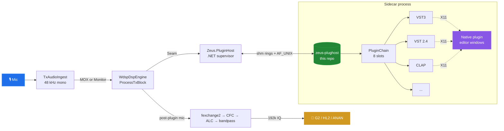

# zeus-plughost

> Out-of-process **VST3 / VST 2.4 / CLAP** host sidecar for the
> [OpenHPSDR Zeus](https://github.com/brianbruff/openhpsdr-zeus) SDR client.

[](LICENSE)
[](#status)
[](#status)
[](https://github.com/brianbruff/openhpsdr-zeus/issues/106)

Zeus is a .NET 10 + WDSP HPSDR client. This sidecar runs as a separate
process and lets ham operators splice general-purpose audio plugins —
EQs, compressors, reverbs, multiband processors — into the **TX mic
chain** before the modulator. A bad plugin crashes the sidecar instead
of the radio.



## Status

| Platform        | Audio path | Editors  | Tested with                                              |
|-----------------|:----------:|:--------:|----------------------------------------------------------|
| Linux x86_64    |     ✅     |    ✅    | ZamGEQ31, ZamVerb, LSP Parametric EQ, MB Expander, etc.  |
| Windows x86_64  |     ⚠️     |    ❌    | sidecar compiles; HWND attach not yet wired              |
| macOS arm64/x64 |     ⚠️     |    ❌    | sidecar compiles; NSView attach not yet wired            |

**Linux x86_64** is operator-tested end-to-end: VST3, VST 2.4 (Vestige),
and CLAP plugins all load, process audio that hits the air, and open
their native editors via X11 attach. Stereo plugins are upmixed/downmixed
against the mono mic chain (mono → L+R → process → mix back to mono).

**Windows + macOS**: sidecar will load + process audio, but
`SlotShowEditor` returns `platform-not-supported`. Operators on those
platforms can drive plugins headlessly via the Zeus slot UI sliders.
HWND + NSView GUI hosts are the next work item — tracked under
[brianbruff/openhpsdr-zeus#106](https://github.com/brianbruff/openhpsdr-zeus/issues/106).

## Build

```bash
git clone https://github.com/Kb2uka/openhpsdr-zeus-plughost.git
cd openhpsdr-zeus-plughost
git submodule update --init                # pulls Steinberg vst3sdk
cmake -S . -B build -DCMAKE_BUILD_TYPE=RelWithDebInfo
cmake --build build -j
```

That produces `build/zeus-plughost`. Linux additionally needs `libx11-dev`.

### How Zeus finds the binary

`Zeus.PluginHost.Native.SidecarLocator` (in the parent repo) looks in this
order:

1. `ZEUS_PLUGHOST_BIN` environment variable
2. Sibling-checkout walk: `<parent>/openhpsdr-zeus-plughost/build/zeus-plughost`
3. `zeus-plughost` on `PATH`

For development with both repos checked out side-by-side, the sibling
walk Just Works.

## Architecture

| Directory      | What lives there                                                                       |
|----------------|----------------------------------------------------------------------------------------|
| `src/main.cpp` | Sidecar entry, control-pipe protocol, audio loop                                       |
| `src/ipc/`     | AF_UNIX control pipe (length-prefixed frames) + lock-free shared-memory audio rings    |
| `src/vst3/`    | Steinberg VST3 plugin host + native editor window infrastructure (X11 + IRunLoop + IPlugFrame) |
| `src/vst2/`    | Linux VST 2.4 plugin host + `IPlugView` wrapper for editors                            |
| `src/clap/`    | CLAP plugin host + `IPlugView` wrapper for editors                                     |
| `src/audio/`   | Sample format + pass-through loop                                                      |

The `IPlugView` wrappers for VST2 + CLAP let one editor host
(`vst3/editor_window.cpp`) drive all three formats, with an
`IEditorIdlePump` hook for the formats that need periodic main-thread
time (`effEditIdle` for VST2, `on_main_thread` + timer dispatch for CLAP).

## Threading model

- **Audio thread** — runs `PluginChain::Process` for every block. Lock-free,
  alloc-free, syscall-free. Reads slot state through atomics.
- **Control thread** — handles plugin Load/Unload/SetParam, GUI Show/Hide
  requests. Uses the AF_UNIX control pipe.
- **GUI thread** — owns the X11 `Display*` and the `EditorWindow` map.
  Dispatches X events, IRunLoop timers + fds, plugin idle ticks.
- **Plugin's own threads** — many plugins spawn their own X11 thread for
  the editor; we don't constrain that.

Sliders fire `audioMasterAutomate` (VST2) / `performEdit` (VST3) /
output events (CLAP). We forward via lossy non-blocking writes on the
control pipe, latest-wins — so a fast slider drag never stalls the
plugin's GUI thread on a full socket buffer.

## Distribution

This repo intentionally has **no release binaries** today. Three viable
deployment paths for the parent Zeus project to ship plugin support to
end users:

1. **Submodule** this repo into `brianbruff/openhpsdr-zeus` at
   `native/zeus-plughost/` and have CMake compile it as part of the
   solution build. Cleanest for distribution.
2. **Vendor** the source under `native/zeus-plughost/` (no submodule).
3. **Per-arch release binaries** uploaded to GitHub Releases here,
   downloaded by the Zeus host (or installer) at first use.

Maintainer (EI6LF) decision pending. See
[brianbruff/openhpsdr-zeus#106](https://github.com/brianbruff/openhpsdr-zeus/issues/106).

## Testing

The .NET-side test suite in `tests/Zeus.PluginHost.Tests` (in the
parent repo) drives this binary. Set
`ZEUS_PLUGHOST_BIN=/path/to/zeus-plughost` before running `dotnet test`.
Several editor / plugin-loading tests are gated on a real plugin binary
being present — see `tests/Zeus.PluginHost.Tests/EditorWindowTests.cs`
for the env vars they look for.

## License

GPL v2 or later. Full text in [LICENSE](LICENSE), third-party
attributions in [ATTRIBUTIONS.md](ATTRIBUTIONS.md), per-file SPDX
identifiers in every source file.

Copyright © 2026 Brian Keating (EI6LF), Douglas J. Cerrato (KB2UKA),
and contributors.
